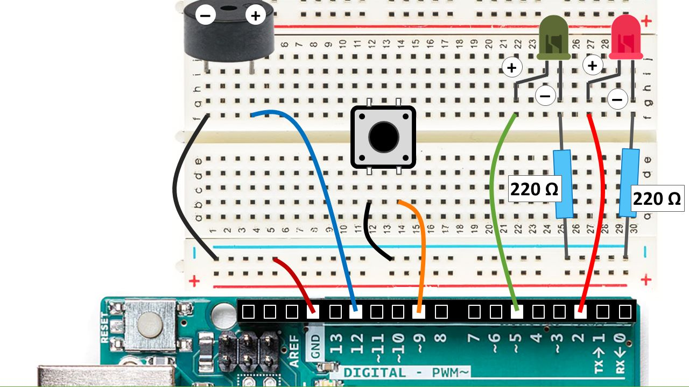

# Arduino Christmas Project
Small Arduino project before Christmas break

The following Arduino demonstration project is:
- playing a christmas tune (playing it after boot, push reset to hear it again)
- flashing two LEDs according to the rhythm of the music
- supporting to connect a push button, stopping and starting the music any time

Please see the C source code in [arduino_christmas.ino](arduino_christmas.ino) and the sematics (also shown below) in [schema.jpg](schema.jpg).
Also feel free to use in the classroom a short presentation available in Hungarian ([arduino_christmas_hu.pptx](arduino_christmas_hu.pptx)) or in English ([arduino_christmas_en.pptx](arduino_christmas_en.pptx)).

## Schema

## License
Feel free to use it, Merry Christmas! ;)

(in more official terms: BSD-3)
